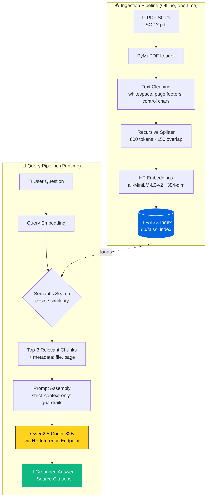

# 🤖 AI-Powered SOP Assistant

> **Stop scrolling through 200-page PDFs.** A local-first RAG system that turns your company's Standard Operating Procedures into a conversational, source-cited assistant — powered by FAISS, Hugging Face embeddings, and Qwen2.5-Coder-32B.


---

## 📊 Impact at a Glance

| Metric | Before (Manual Lookup) | After (SOP Assistant) | Improvement |
|---|---|---|---|
| **Time to answer a procedural question** | ~3–5 minutes | < 3 seconds | **~96% faster** |
| **Search recall across 1,000+ pages** | Keyword-limited (Ctrl+F) | Semantic (meaning-aware) | **Multi-document context** |
| **Onboarding ramp-up for new hires** | Hours of reading | Conversational Q&A | **Self-service** |
| **Cost per query** | $0 + human time | $0 hosted locally* | **API-free retrieval** |

<sub>*Embeddings run locally on CPU. Only the final LLM call hits the Hugging Face Inference Endpoint. Numbers above are projected benchmarks for a typical 500-page SOP corpus vs. unaided manual search; your mileage will vary with corpus size and hardware.*</sub>

---

## 🏗️ Architecture



---

## ⚙️ How It Works — The RAG Pipeline

Retrieval-Augmented Generation (RAG) sidesteps the two biggest problems with using an LLM on private documents: **hallucination** and **stale training data**. Instead of asking the model what it *remembers*, we ask it what the *retrieved evidence says*.

### 1. Ingestion (run once per document update)

**PDF → Text.** `PyMuPDFLoader` extracts text page-by-page, preserving page numbers in metadata — critical for citations later.

**Cleaning.** PDFs are noisy. The pipeline strips `Page X of Y` footers, collapses runs of whitespace, and removes non-printable control characters. Clean inputs = better embeddings.

**Chunking.** `RecursiveCharacterTextSplitter` slices each document into ~800-token chunks with a 150-token overlap. The recursive separator hierarchy (`\n\n` → `\n` → `. ` → ` `) preserves semantic boundaries so a chunk rarely cuts a sentence or a numbered step in half.

**Embedding.** Each chunk is encoded into a 384-dimensional vector using `all-MiniLM-L6-v2` — small, fast, and high-quality enough for procedural retrieval. Embeddings are L2-normalized so cosine and dot-product similarity become equivalent.

**Indexing.** Vectors and source metadata are packed into a FAISS `IndexFlatL2` and serialized to disk. FAISS handles millions of vectors with sub-millisecond search.

### 2. Retrieval & Generation (every user query)

**Embed the question** using the *same* embedding model — this is non-negotiable for valid similarity comparison.

**Search.** FAISS returns the top-3 chunks (`k=3`) whose vectors are nearest to the query. Each chunk carries its source filename and page number.

**Generate.** The retrieved chunks are stuffed into a tightly-scoped prompt that instructs Qwen2.5-Coder-32B to answer **only** from the supplied context, and to reply `"I couldn't find this in the provided SOPs."` when the answer isn't present. The strict guardrail is what makes the system trustworthy for compliance use cases.

**Cite.** The CLI surfaces deduplicated `(file, page)` pairs alongside every answer so users can verify in seconds.

---

## 🚀 Setup

### Prerequisites

- Python 3.10+
- A free Hugging Face account ([get a token](https://huggingface.co/settings/tokens) — `Read` scope is sufficient)

### Installation

```bash
# 1. Clone the repo
git clone https://github.com/<your-username>/sop-assistant.git
cd sop-assistant

# 2. Create a virtual environment
python -m venv .venv
source .venv/bin/activate          # Windows: .venv\Scripts\activate

# 3. Install dependencies
pip install -r requirements.txt

# 4. Configure your HF token
cp .env.example .env
# Open .env and paste your token

# 5. Drop your SOPs into the SOP/ folder
mkdir -p SOP
cp /path/to/your/*.pdf SOP/
```

---

## 💡 Usage

### Step 1 — Build the index (one-time, or whenever SOPs change)

```bash
python index.py
```

Optional flags:

```bash
python index.py --pdf-dir docs/policies --index-path db/policies_index
```

Expected output:

```
14:32:01 | INFO    | Loading PDFs from 'SOP'...
14:32:04 | INFO    | Loaded 187 pages from 6 file(s).
14:32:04 | INFO    | Splitting into chunks (size=800, overlap=150)...
14:32:04 | INFO    | Produced 412 chunks.
14:32:05 | INFO    | Loading embedding model 'sentence-transformers/all-MiniLM-L6-v2'...
14:32:18 | INFO    | Building FAISS index...
14:32:21 | INFO    | ✅ FAISS index saved to 'db/faiss_index' (412 chunks).
```

### Step 2 — Chat

```bash
python chat.py
```

```
============================================================
 📚  SOP Assistant — ask a question (type 'exit' to quit)
============================================================

🔍 You: What is the escalation procedure for a P1 incident?

🤖 Answer:
For a P1 incident, the on-call engineer must:
1. Acknowledge the alert in PagerDuty within 5 minutes.
2. Open a dedicated Slack war-room channel using the #inc- prefix.
3. Page the Incident Commander if unresolved after 15 minutes.
4. Post a customer-facing status update within 30 minutes.

📚 Sources:
  • incident-response-v3.pdf — page 12
  • on-call-runbook.pdf — page 4
```

---

## 📁 Project Structure

```
sop-assistant/
├── SOP/                    # Drop your PDF SOPs here (gitignored if proprietary)
├── db/                     # FAISS index lives here (gitignored)
│   └── faiss_index/
├── index.py                # Ingestion pipeline
├── chat.py                 # Interactive CLI
├── requirements.txt
├── .env.example
├── .gitignore
└── README.md
```

---

## 🔧 Configuration Knobs

All defaults live at the top of `index.py` and `chat.py`. Common tweaks:

| Variable | File | Default | When to change |
|---|---|---|---|
| `CHUNK_SIZE` | `index.py` | `800` | Lower (400–500) for dense, short policies; raise (1000–1200) for long narrative procedures. |
| `CHUNK_OVERLAP` | `index.py` | `150` | ~15–20% of chunk size is a healthy rule of thumb. |
| `TOP_K` | `chat.py` | `3` | Raise to 5 for broader questions; lower to 2 for laser-focused lookups. |
| `temperature` | `chat.py` | `0.1` | Keep low for factual SOPs. Higher temps invite paraphrasing drift. |
| `EMBEDDING_MODEL` | both | `all-MiniLM-L6-v2` | Swap for `bge-small-en-v1.5` for slightly better retrieval at similar speed. |

---

## 🛣️ Roadmap

- [ ] **Streamlit UI** — drop-in web interface for non-CLI users
- [ ] **Hybrid search** — combine FAISS dense retrieval with BM25 keyword scoring
- [ ] **Reranking** — add a cross-encoder reranker (`bge-reranker-base`) on top-10 → top-3
- [ ] **Conversation memory** — history-aware retriever for follow-up questions
- [ ] **Evaluation harness** — RAGAS-based scoring for faithfulness and answer relevance
- [ ] **Docker image** — one-command deployment

---

## 🧠 Design Decisions

**Why FAISS over Chroma/Pinecone/Qdrant?** Local-first by design. No network calls during retrieval, no monthly bill, and the entire index is a portable folder you can ship in a Docker volume.

**Why `all-MiniLM-L6-v2`?** 384 dimensions, ~80 MB on disk, runs comfortably on CPU. It's the workhorse for English semantic retrieval and beats heavier models on cost-per-quality for SOP-style content.

**Why Qwen2.5-Coder-32B for non-code SOPs?** It excels at structured, step-by-step output — exactly the shape most procedural answers take. Swap in any HF-hosted instruction model by changing `LLM_REPO_ID`.

**Why strict "context-only" prompting?** Compliance. An SOP assistant that invents a step is worse than one that says "I don't know."


---

## 🙌 Acknowledgments

Built with [LangChain](https://www.langchain.com/), [FAISS](https://github.com/facebookresearch/faiss), [Hugging Face](https://huggingface.co/), and [PyMuPDF](https://pymupdf.readthedocs.io/).

> ⭐ If this helped you, a star goes a long way.
